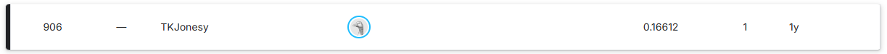

# March Madness with Machine Learning (2026)

Welcome to my March Madness 2026 repository! This repository contains all the code and data I used to train a model to assist with the creation of my bracket for 2026 and entering the Kaggle [March Machine Learning Mania 2026](https://www.Kaggle.com/competitions/march-machine-learning-mania-2026/).

## Table of Contents

- [Results From 2025](#results-from-2025)
- [Changes for 2026](#changes-for-2026)
- [Data Preprocessing](#data-preprocessing)
- [Hyperparameter Tuning](#hyperparameter-tuning)
- [Results After Training](#results-after-training)
- [Results From the Competition](#results-from-the-competition)
- [Insights and Improvements for Next Year](#insights-and-improvements-for-next-year)

## Results From 2025

In 2025, I finished 906 out of 1727 teams. That's in the top 53%. I also scored a Brier score of 0.16612, which was not too far from my target of 0.155 that year. While it wasn't enough to yield a higher percentile finish in the competition, it leaves plenty of room for growth this year!

## Changes for 2026
This year I aim to make two major improvements:

1. Test additional Machine Learning algorithms. My plan is to experiment with Random Forest, as well as Gradient Boosting. I have had a lot of success with Gradient Boosting since last year and hope to bring that to this competition.
2. Experiment with more advanced and derived features. My strategy last year was to throw every feature I could at the model. That approach can work with some decision tree models but likely led to overfitting. This year I want to create meaningful features that can replace a majority of the raw features to aid with reducing dimensionality. 

## Data Preprocessing
For 2026 I have decided only to use [data](https://www.Kaggle.com/competitions/march-machine-learning-mania-2026/data) provided by Kaggle to avoid having to handle any team spelling differences across datasets. Kaggle has very nicely assigned UIDs to each team to keep track of them throughout the seasons and without comparing strings.

For this year, most of the data will come from box score stats provided in [MRegularSeasonDetailedResults.csv](/data/men/MRegularSeasonDetailedResults.csv):

Description from [Kaggle:](https://www.Kaggle.com/competitions/march-machine-learning-mania-2026/data)
- **WFGM** - field goals made (by the winning team)
- **WFGA** - field goals attempted (by the winning team)
- **WFGM3** - three pointers made (by the winning team)
- **WFGA3** - three pointers attempted (by the winning team)
- **WFTM** - free throws made (by the winning team)
- **WFTA** - free throws attempted (by the winning team)
- **WOR** - offensive rebounds (pulled by the winning team)
- **WDR** - defensive rebounds (pulled by the winning team)
- **WAst** - assists (by the winning team)
- **WTO** - turnovers committed (by the winning team)
- **WStl** - steals (accomplished by the winning team)
- **WBlk** - blocks (accomplished by the winning team)
- **WPF** - personal fouls committed (by the winning team)

(And then the same set of stats from the perspective of the losing team: LFGM is the number of field goals made by the losing team, and so on up to LPF).

I began by splitting the data to focus on one team to track the number of wins and losses for each team, and the number of games played by that team.

So for each row in MRegularSeasonDetailedResults.csv, I split it into two rows, one for each team. Then I grouped the dataframe on the Season and TeamID, ending up with the following columns: 

['Score', 'OppScore', 'NumOT', 'FGM', 'FGA', 'FGM3', 'FGA3', 'FTM', 
       'FTA', 'OR', 'DR', 'Ast', 'TO', 'Stl', 'Blk', 'PF', 'OppFGM', 
       'OppFGA', 'OppFGM3', 'OppFGA3', 'OppFTM', 'OppFTA', 'OppOR', 
       'OppDR', 'OppAst', 'OppTO', 'OppStl', 'OppBlk', 'OppPF', 'Win', 
       'Loss']

### Feature Creation
This year I opted to not include the raw boxscore stats as features but only these derived stats which I believe will be as informative while reducing dimensionality:

- **Points Ratio** - ratio of points scored to opponent's points scored.
- **Win/Loss Ratio** - self-explanatory.
- **Margin of Victory** - on average, how close is the score of each game.
- **Turnover Ratio** - ratio of TOs to OppTOs.
- **Scoring Efficiency** - ratio of made shots to attempts. (How well does a team shoot in general)
- **3-Point Efficiency** - ratio of 3-pointers made to attempted. (How well does a team shoot 3s)
- **3-Point Attempt Rate** - ratio of 3-pointers attempted to all shots attempted. (How reliant is a team on 3s)
- **Free Throw Efficiency** - ratio of free throws made to attempted. (How well does a team make free throws)
- **Free Throw Attempt Rate** - ratio of free throws attempted to all shots attempted. (How often a team gets to the line)
- **Opponent Free Throw Attempt Rate** - ratio of free throws attempted by opponents to all shots attempted by opponents. (How often a team sends their opponent to the line)
- **Offensive Rebound Rate** - ratio of ORs to all rebounds that happen while they are on offense. (How well a team attacks the glass on offense)
- **Defensive Rebound Rate** - ratio of DRs to all rebounds that happen while they are on defense. (How well a team attacks the glass on defense)

**New Features for 2026:**
- **Estimated Possessions** - rough estimate of total possessions using field goal attempts, offensive rebounds, turnovers, and free throws.
- **Offensive Efficiency** - points scored per possession. (How efficiently a team scores)
- **Defensive Efficiency** - opponent points scored per possession. (How well a team prevents scoring)
- **Net Efficiency** - difference between offensive and defensive efficiency. (Overall team strength)
- **Turnover Percentage** - turnovers per possession. (How often a team loses the ball)
- **Assist Percentage** - ratio of assists to made field goals. (How often scoring is assisted)
- **Assist-to-Turnover Ratio** - ratio of assists to turnovers. (Ball movement vs mistakes)
- **Assist Ratio** - ratio of team assists to opponent assists. (Relative passing performance)
- **Offensive Rebound Percentage** - ratio of offensive rebounds to missed shots. (How well a team recovers misses on offense)
- **Defensive Rebound Percentage** - ratio of defensive rebounds to opponent missed shots. (How well a team secures rebounds on defense)
- **True Shooting Percentage** - scoring efficiency accounting for field goals and free throws. (Overall scoring efficiency)

After getting these derived stats at a single game level, I then got the season averages and a 5-window average (last 5 games of the regular season). This approach will give me an idea of how a team performs in the season as a whole and how they are trending near the end of the season.

To reduce dimensionality even further, the final input to the models became the tournament matchups as Team1 Features - Team2 Features.

**Final Features for 2026 Competition** 
To get the final features for this year I took this 3-step approach:

1. Remove highly correlated features. Using a 90% threshold, I removed the less informative feature from each pair.
2. Trained a baseline (default params) model for Random Forest, Logistic Regression, and XGBoost. For each model I saved the top 30 features from the feature importance attribute of the models (Coefficients for LR).
3. Arrived at the final feature set by taking the intersection of the top 30 features from each model.

From that process I arrived at these final features: 
['Last_5_Avg_AstTORatio_Diff', 'Last_5_Avg_DR%_Diff', 'Last_5_Avg_DRRatio_Diff', 'Last_5_Avg_OR%_Diff', 
'Last_5_Avg_OppFTM%_Diff', 'Season_Avg_Ast%_Diff', 'Season_Avg_FG3%M_Diff', 'Season_Avg_FGA3%_Diff', 
'Season_Avg_FTR_Diff', 'Season_Avg_NetEff_Diff', 'Season_Avg_OR%_Diff', 'Season_Avg_OffEff_Diff',  
'Season_Avg_TORatio_Diff', 'Season_Avg_TS%_Diff', 'Season_Avg_W/L_Diff', 'Seed_Diff']

## Hyperparameter Tuning
For each model I utilized a grid search to arrive at these ideal parameters:

**Random Forest** 
[max_depth=7,
max_features=None,
min_samples_leaf=5,
n_estimators=500,
criterion='log_loss']

**Logistic Regression** 
[C=0.1623776739188721,
class_weight='balanced',
l1_ratio=0.05,
penalty='elasticnet',
solver='saga']

**XGBoost** 
[colsample_bytree=0.7,
max_depth=3,
min_child_weight=10,
reg_lambda=5,
subsample=0.7,
n_estimators=200,
objective='binary:logistic',
eval_metric='logloss']

After getting a baseline model and a tuned model, I then introduced a calibrated model [(CalibratedClassifierCV)](https://scikit-learn.org/stable/modules/generated/sklearn.calibration.CalibratedClassifierCV.html) to help adjust the probabilities to give my Brier score a little boost.

So for each algorithm I ended with 4 models: base, tuned, base calibrated, tuned calibrated.

## Results After Training
For a train/test split I decided to have the test set be last year (2025) and let everything else be in the training set. This results in a roughly 95:5 split, which I know is not ideal, so I plan to allocate more data to testing next year. Here are the training results from all 12 models: 

### Base Random Forest
- **Training Accuracy**: 1.0000  
- **Testing Accuracy (2025)**: 0.7948  
- **Brier Score**: 0.1486  
- **Log Loss**: 0.4603  

### Base Calibrated Random Forest
- **Training Accuracy**: 0.9941  
- **Testing Accuracy (2025)**: 0.8284  
- **Brier Score**: 0.1430  
- **Log Loss**: 0.4508  

### Tuned Random Forest
- **Training Accuracy**: 0.7711  
- **Testing Accuracy (2025)**: 0.8246  
- **Brier Score**: 0.1401  
- **Log Loss**: 0.4326  

### Tuned Calibrated Random Forest
- **Training Accuracy**: 0.7676  
- **Testing Accuracy (2025)**: 0.8246  
- **Brier Score**: 0.1365  
- **Log Loss**: 0.4296  

---

### Base Logistic Regression
- **Training Accuracy**: 0.7430  
- **Testing Accuracy (2025)**: 0.7836  
- **Brier Score**: 0.1435  
- **Log Loss**: 0.4392  

### Base Calibrated Logistic Regression
- **Training Accuracy**: 0.7423  
- **Testing Accuracy (2025)**: 0.7836  
- **Brier Score**: 0.1437  
- **Log Loss**: 0.4401  

### Tuned Logistic Regression
- **Training Accuracy**: 0.7421  
- **Testing Accuracy (2025)**: 0.7836  
- **Brier Score**: 0.1433  
- **Log Loss**: 0.4393  

### Tuned Calibrated Logistic Regression
- **Training Accuracy**: 0.7423  
- **Testing Accuracy (2025)**: 0.7836  
- **Brier Score**: 0.1437  
- **Log Loss**: 0.4401  

---

### Base XGBoost
- **Training Accuracy**: 0.9989  
- **Testing Accuracy (2025)**: 0.7910  
- **Brier Score**: 0.1495  
- **Log Loss**: 0.4619  

### Base Calibrated XGBoost
- **Training Accuracy**: 0.9996  
- **Testing Accuracy (2025)**: 0.7836  
- **Brier Score**: 0.1572  
- **Log Loss**: 0.4887  

### Tuned XGBoost
- **Training Accuracy**: 0.8732  
- **Testing Accuracy (2025)**: 0.7649  
- **Brier Score**: 0.1602  
- **Log Loss**: 0.4801  

### Tuned Calibrated XGBoost
- **Training Accuracy**: 0.8570  
- **Testing Accuracy (2025)**: 0.7687  
- **Brier Score**: 0.1605  
- **Log Loss**: 0.4826

For the Kaggle competition I chose the model that seemed the least overfit and produced a strong Brier score for 2025: Tuned Calibrated Random Forest.

## Results From the Competition
I will update this when the competition has concluded.

## Insights and Improvements for Next Year
I will update this when the competition has concluded.